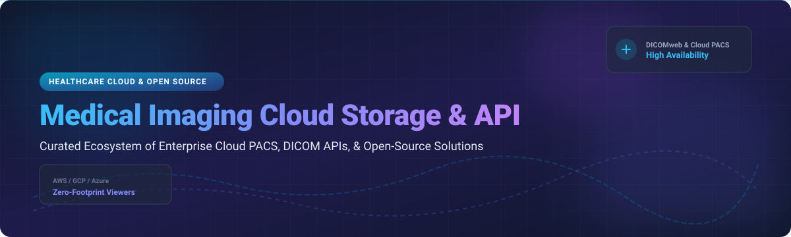

# Awesome Medical Imaging Cloud Storage & API Ecosystem 🏥⚡

  
  
  
  
  

Welcome to the definitive, curated list of enterprise **SaaS Medical Imaging Cloud Platforms**, **DICOM Cloud Storage APIs**, and **Open-Source Self-Hosted PACS Solutions** 🚀. Whether you are building AI-assisted diagnostic pipelines, setting up cloud VNA archives, or seeking zero-footprint DICOM web viewers, this guide aggregates top industry tools with detailed benchmarks, pricing structures, valuation insights, and repository metrics.

---

## 📑 Table of Contents
- [📊 Market Overview & Industry Structure](#-market-overview--industry-structure)
- [☁️ Commercial SaaS & Cloud Platforms](#️-commercial-saas--cloud-platforms)
- [🔓 Open-Source GitHub Projects](#-open-source-github-projects)
  - [DICOM Servers & Cloud PACS](#dicom-servers--cloud-pacs)
  - [AI Frameworks & Medical Imaging Libraries](#ai-frameworks--medical-imaging-libraries)
  - [Viewers & Web Tools](#viewers--web-tools)
  - [DICOM Tools & SDKs](#dicom-tools--sdks)
- [🤝 How to Contribute](#-how-to-contribute)
- [☕ Support & Sponsorship](#-support--sponsorship)
- [⚠️ Disclaimer & Compliance](#%EF%B8%8F-disclaimer--compliance)
- [📈 Star History](#-star-history)

---

## 📊 Market Overview & Industry Structure

The **Global Medical Imaging Cloud Storage & Solutions Market** was valued at **$4.70 Billion in 2025** and is projected to reach **$5.00 Billion in 2026**, growing at a **CAGR of 7.20% (2026–2032)**. Driven by exponential volumes of 3D diagnostic scans (CT, MRI, PET) and cloud-native AI pipeline deployments, health systems are rapidly migrating from legacy on-premises archives to hybrid and cloud VNA infrastructures.

> 💡 **Market Fragmentation Status:** **Moderately Fragmented with Emerging Cloud Concentration.**  
> Standard DICOM storage infrastructure and hyperscaler APIs (AWS, Google Cloud, Azure) exhibit strong consolidation around public cloud platforms. However, downstream clinical AI apps, specialty viewers, and workflow automation tools remain **highly fragmented**, offering massive opportunities for specialized SaaS and open-source integrations.

---

## ☁️ Commercial SaaS & Cloud Platforms

Below is a comparative breakdown of leading commercial medical imaging cloud products sorted by **Company Size / Market Valuation (Descending)** 📉.

| Platform / Product | Category & Key Focus 🎯 | Pricing Tier (Starting Rate) 💰 | Free Tier Limit / Trial 🆓 | Company Size / Valuation / Revenue 🏢 |
| :--- | :--- | :--- | :--- | :--- |
| **[Google Cloud Medical Imaging Suite](https://cloud.google.com/medical-imaging)** ☁️ | Cloud Healthcare DICOM API, BigQuery & Vertex AI integration | Nearline: ~$0.02/GiB/mo; Coldline: ~$0.01/GiB/mo; Archive: ~$0.003/GiB/mo + operation fees | No permanent free tier; **$300 Free Credits** valid for 90 days across GCP services | **~$2.0 Trillion** (Alphabet Inc. Market Cap) |
| **[Azure Health Data Services DICOM](https://azure.microsoft.com/en-us/products/health-data-services/)** 💻 | Enterprise DICOMweb REST API & Azure FHIR sync | Blob Storage: $0.023/GB/mo; Structured Metadata: $0.39/GB/mo + $0.54 per 100k API requests | No permanent free tier; **$200 Azure Free Credits** + 30-day trial allowance | **~$3.1 Trillion** (Microsoft Corp. Market Cap) |
| **[AWS HealthImaging](https://aws.amazon.com/healthimaging/)** 📦 | Cloud-native DICOMweb storage with HTJ2K encoding & fast retrieval | Frequent Access: $0.105/GB/mo; Archive Instant Access: $0.006/GB/mo | **20 GB/month free** (10 GB Frequent + 10 GB Archive) + 20,000 API requests/mo | **~$2.2 Trillion** (Amazon.com Inc. Market Cap) |
| **[Sectra Cloud](https://medical.sectra.com/)** 🏥 | SaaS Enterprise PACS & VNA for health networks | Enterprise subscription based on study volume (Custom Quote starting ~$1,500/mo per site) | **30-Day Enterprise Sandbox Demo** (upon clinical request) | **~$6.5 Billion** (Sectra AB Market Cap, Public SEC-B) |
| **[Intelerad Ambra Health](https://www.intelerad.com/)** 🔄 | Cloud Image Exchange, FDA 510(k) HTML5 Viewer & VNA | Tiered SaaS pricing based on annual study volume (Starting ~$1,000/month) | **14-Day Guided Enterprise Trial** (Up to 50 test uploads) | **$2.3 Billion** (Acquired by GE HealthCare; ~$270M annual revenue) |
| **[Aidoc](https://www.aidoc.com/)** 🤖 | Clinical AI platform with 17+ FDA-cleared triage algorithms | Per-scan AI analysis subscription (Starting ~$15-$25 per analyzed scan or site license) | **30-Day Clinical Validation Pilot** for enterprise radiology departments | **~$1.0+ Billion** (Unicorn status; $500M+ total VC funding including Series E) |
| **[Flywheel](https://flywheel.io/)** 🔬 | Medical imaging data activation, curation & AI trial platform | Cloud platform subscription starting at ~$25,000/year for research labs | **14-Day Institutional Sandbox Trial** with sample DICOM datasets | **~$200 Million - $300 Million** (Estimated valuation; $70M+ total VC funding) |
| **[Arterys](https://www.arterys.com/)** ea | Cloud web viewer with Cardiac & Stroke AI analytics | Usage SaaS pricing starting at ~$500/month or per-procedure fee | **30-Day Free Clinical Trial** with standard demo study sets | **~$150 Million - $200 Million** (Acquired by Tempus Labs; $70M prior VC funding) |
| **[RamSoft OmegaAI](https://www.ramsoft.com/)** ⚡ | Azure-native cloud RIS/PACS with zero-footprint web viewer | SaaS subscription per provider starting at ~$350/user/month | **30-Day Live Product Demo & Evaluation Access** | **~$50 Million - $100 Million** (Private enterprise revenue estimate) |
| **[Enlitic](https://www.enlitic.com/)** 🏷️ | Medical imaging data standardization & hanging protocol AI | Enterprise licensing per clinical node (Starting ~$15,000/year per facility) | **Custom Data Quality Audit Trial** (De-identified dataset assessment) | **~$40 Million** (Publicly traded ASX: ENL) |

---

## 🔓 Open-Source GitHub Projects

Medical imaging benefits from a robust open-source ecosystem. Below are top GitHub repositories sorted by **GitHub Stars_Count (Descending)** 🌟.

### 🌟 Top Open-Source Projects at a Glance

| Repository | Description 📝 | License 📜 | GitHub_Stars ⭐ |
| :--- | :--- | :--- | :--- |
| **[MONAI](https://github.com/Project-MONAI/MONAI)** | PyTorch-based AI framework for deep learning in healthcare imaging | Apache-2.0 |  |
| **[OHIF Viewer](https://github.com/OHIF/Viewers)** | De facto standard zero-footprint web DICOM viewer in React | MIT |  |
| **[VTK](https://github.com/Kitware/VTK)** | Visualization Toolkit for 3D computer graphics, image processing & DICOM | BSD-3-Clause |  |
| **[3D Slicer](https://github.com/Slicer/Slicer)** | Cross-platform software for medical image informatics & 3D visualization | Slicer License |  |
| **[pydicom](https://github.com/pydicom/pydicom)** | Pure Python package for reading, modifying, and writing DICOM data | MIT |  |
| **[dcm4che](https://github.com/dcm4che/dcm4che)** | High-performance Java DICOM toolkit & utilities | MPL-1.1 |  |
| **[Weasis](https://github.com/nroduit/Weasis)** | Modular cross-platform DICOM viewer desktop app | EPL-2.0 |  |
| **[Cornerstone3D](https://github.com/cornerstonejs/cornerstone3D)** | JavaScript/WebGL library for rendering 2D/3D medical images in browser | MIT |  |
| **[DCMTK](https://github.com/DCMTK/dcmtk)** | The foundational reference C++ DICOM toolkit and library | BSD-3-Clause |  |
| **[Horos](https://github.com/horosproject/horos)** | Free open-source macOS 64-bit medical image viewer | LGPL-3.0 |  |
| **[Dicoogle](https://github.com/bioinformatics-ua/dicoogle)** | Extensible open-source PACS with plugin architecture & index search | GPL-3.0 |  |
| **[dcm4chee-arc-light](https://github.com/dcm4che/dcm4chee-arc-light)** | Enterprise open-source DICOM archive & PACS backend | MPL-1.1 |  |
| **[GDCM](https://github.com/malaterre/GDCM)** | Grassroots DICOM C++ library with bindings for Python, C# and Java | BSD-3-Clause |  |
| **[dcmjs](https://github.com/dcmjs-org/dcmjs)** | JavaScript DICOM manipulation library for browser & Node.js | MIT |  |
| **[DICOMcloud](https://github.com/DICOMcloud/DICOMcloud)** | Azure-friendly .NET DICOMweb server implementing STOW, QIDO, WADO | MIT |  |
| **[DICOMweb-js](https://github.com/DICOMcloud/DICOMweb-js)** | Pure JavaScript client SDK for DICOM Web Services | MIT |  |
| **[Orthanc](https://github.com/jodogne/Orthanc)** | Lightweight C++ DICOM server, REST API, & Digital Public Good | GPL-3.0 |  |
| **[dicomweb-proxy](https://github.com/knopkem/dicomweb-proxy)** | Proxy translator between DICOMweb REST API and legacy DIMSE | MIT |  |
| **[raccoon-dicom](https://github.com/Chinlinlee/raccoon-dicom)** | MongoDB-backed Node.js miniPACS server implementation | MIT |  |

---

### Detailed Category Highlights

#### 📦 DICOM Servers & Cloud PACS
- **[Orthanc](https://github.com/jodogne/Orthanc)**   
  *Lightweight, standalone C++ DICOM server with built-in RESTful API and multi-tenant plugins.*
- **[dcm4chee-arc-light](https://github.com/dcm4che/dcm4chee-arc-light)**   
  *Enterprise PACS archive running on Java EE, Docker-ready with web management interface.*
- **[Dicoogle](https://github.com/bioinformatics-ua/dicoogle)**   
  *Search engine & PACS alternative featuring extensible indexers for medical research.*
- **[DICOMcloud](https://github.com/DICOMcloud/DICOMcloud)**   
  *.NET server optimized for Azure Cloud Storage supporting QIDO-RS, WADO-RS, and STOW-RS.*

#### 🧠 AI Frameworks & Medical Imaging Libraries
- **[MONAI](https://github.com/Project-MONAI/MONAI)**   
  *Domain-specific PyTorch framework for healthcare imaging and clinical AI workflow development.*
- **[3D Slicer](https://github.com/Slicer/Slicer)**   
  *Desktop platform for image analysis, 3D volume rendering, surgical planning, and research.*

#### 🖥️ Viewers & Web Tools
- **[OHIF Viewer](https://github.com/OHIF/Viewers)**   
  *React-based zero-footprint web viewer connecting seamlessly with DICOMweb servers.*
- **[Cornerstone3D](https://github.com/cornerstonejs/cornerstone3D)**   
  *WebGL component architecture for rendering medical images directly in Web applications.*
- **[Weasis](https://github.com/nroduit/Weasis)**   
  *Desktop DICOM viewer with desktop integration and multi-monitor diagnostic capabilities.*

---

## 🤝 How to Contribute

Contributions are welcome! Please follow these steps to add new platforms or tools:

1. 🍴 **Fork** this repository.
2. ✍️ Update `README.md` with factual information.
3. 📝 Format entries cleanly following table guidelines.
4. 🚀 Submit a **Pull Request** with a concise description of changes.

---

## ☕ Support & Sponsorship

If you find this repository helpful for your cloud architecture, radiology research, or engineering projects, please consider supporting the maintenance of this list!

- ⭐ **Star** this repository on GitHub.
- 🔀 **Fork & Share** with your colleagues and teams.
- ☕ **Buy Me a Coffee / Sponsor**: Support ongoing maintenance via [GitHub Sponsors](https://github.com/sponsors/ishandutta2007) 💖.

---

## ⚠️ Disclaimer & Compliance

- This repository is a **community-curated list** for informational and research purposes only.
- **HIPAA / GDPR Compliance**: Storing or transmitting Protected Health Information (PHI) requires appropriate cloud Business Associate Agreements (BAA), end-to-end encryption, strict access control, and regulatory clearance.
- **FDA / CE Medical Device Regulation**: Software used for clinical diagnosis must possess appropriate regulatory clearances (e.g., FDA 510(k), CE mark).

---

## 📈 Star History

---
*Made with ❤️ for medical imaging engineers, PACS admins, and healthcare AI researchers.*
